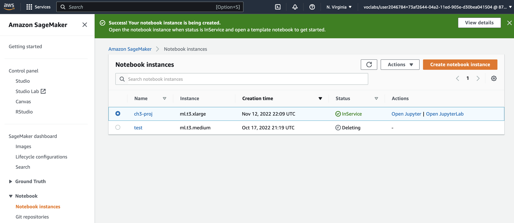

# udacity-aws-machine-learning-engineer-nanodegree-ch3-operationalizing-an-aws-ml-project
udacity-aws-machine-learning-engineer-nanodegree-ch3-operationalizing-an-aws-ml-project

# Initial setup, training and deployment
## Initial Setup
First, find and download your starter files, which are located in the Resources section for this project lesson. The starter file called train_and_deploy-solution.ipynb is a Jupyter notebook that trains and deploys a computer vision model. The starter file called hpo.py is the "entry point" for the train_and_deploy-solution.ipynb notebook. You can upload both of these files to a Sagemaker instance and run them there, using Jupyter or JupyterLab.

Before you run these files, you'll have to create and open a Sagemaker instance. Decide which type of Sagemaker instance you should create for your training and deployment. Consider the cost, computing power, and speed of launching for each instance type. Write a short justification of why you chose the instance type you did. After you launch your Sagemaker instance, take a screenshot of your Sagemaker dashboard's Notebooks > Instances section to show what you've done.

Note: For this project, you should perform all of the Sagemaker steps using Sagemaker itself, not Sagemaker Studio.
Sagemaker Dashboard screenshots

## Justification
I chose an ml.t3.xlarge, because I encountered a memory insufficiency error using ml.t3.medium (to save costs). Per docs https://docs.aws.amazon.com/sagemaker/latest/dg/howitworks-create-ws.html, if more memory is needed, recommend large or xlarge.

# Download data to an S3 bucket
The first three cells of the train_and_deploy-solution.ipynb will download data to your AWS workspace. The third cell copies the data to an S3 bucket. You need to set up an S3 bucket that you can copy the data to.

After you set up an S3 bucket, take a screenshot showing that you've set up an S3 bucket. Include this screenshot in your final submission.

After setting up an S3 bucket, you need to change some cells in the train_and_deploy-solution.ipynb notebook. In particular, the third cell, eighth cell, and sixteenth cell contain references to an S3 bucket called s3://udacitysolution/. You need to find all references to this bucket name and change them so they refer to the name of the S3 bucket that you created.

After changing all of these references, you will be prepared to run the first three cells of your train_and_deploy-solution.ipynb notebook. Run these cells to download training and validation data for the project's ML pipeline.