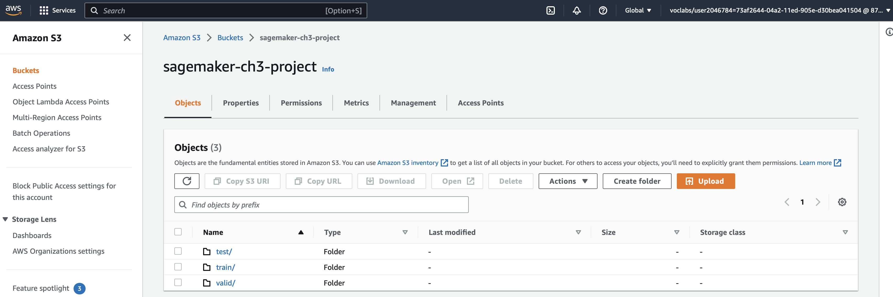
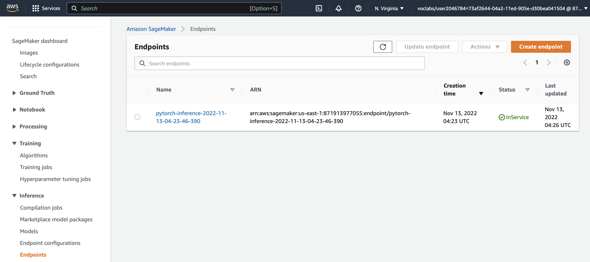
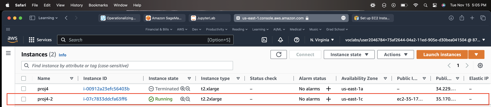
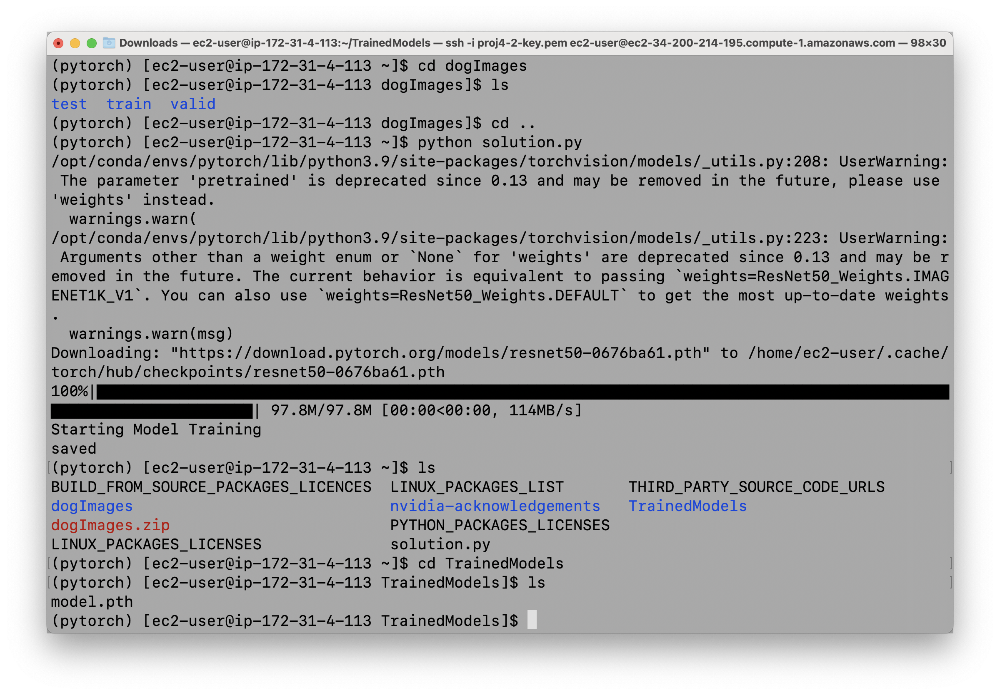
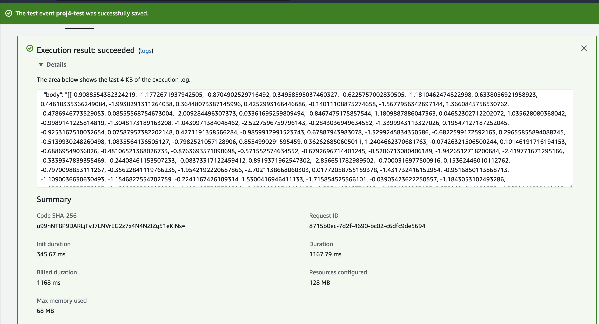
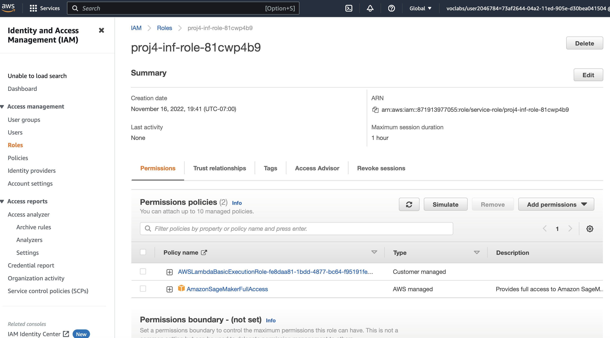

# udacity-aws-machine-learning-engineer-nanodegree-ch3-operationalizing-an-aws-ml-project
udacity-aws-machine-learning-engineer-nanodegree-ch3-operationalizing-an-aws-ml-project

# Initial setup, training and deployment
## Initial Setup and Justification
I chose an ml.t3.xlarge, because I encountered a memory insufficiency error using ml.t3.medium (to save costs). Per docs https://docs.aws.amazon.com/sagemaker/latest/dg/howitworks-create-ws.html, if more memory is needed, recommend large or xlarge.


After you set up an S3 bucket, take a screenshot showing that you've set up an S3 bucket. Include this screenshot in your final submission.
## Screenshot of S3 bucket


# Training and Deployment
## Screenshot of deployed endpoint in Inference > Endpoints


# EC2 Training
## Justification for EC2 Instance
For EC2 Training I decided to choose something relatively low cost, but with more memory than the base tier - t2.xlarge (4 vCPUs and 16 Gib memory) This is to strike a balance between cost and performance.


## Saved EC2 Model


## Differences between SageMaker code and EC2 training code
1. Reduced use of logger.  
    ```logger=logging.getLogger(__name__)
    logger.setLevel(logging.DEBUG)
    logger.addHandler(logging.StreamHandler(sys.stdout))```
2. No main function or arg parser

# Lambda Function
I created a lambda function using the provided starter file. Within the function, I provided the endpoint name.

## Test inference

This is my test event:  
```
{ "url": "https://s3.amazonaws.com/cdn-origin-etr.akc.org/wp-content/uploads/2017/11/20113314/Carolina-Dog-standing-outdoors.jpg" }
```
Here are the results of the invocation:
```
{
  "statusCode": 200,
  "headers": {
    "Content-Type": "text/plain",
    "Access-Control-Allow-Origin": "*"
  },
  "type-result": "<class 'str'>",
  "COntent-Type-In": "LambdaContext([aws_request_id=8715b0ec-7d2f-4690-bc02-c6dfc9de5694,log_group_name=/aws/lambda/proj4-inf,log_stream_name=2022/11/17/[$LATEST]90a7ebba9fa04ee88968e73a63fd3710,function_name=proj4-inf,memory_limit_in_mb=128,function_version=$LATEST,invoked_function_arn=arn:aws:lambda:us-east-1:871913977055:function:proj4-inf,client_context=None,identity=CognitoIdentity([cognito_identity_id=None,cognito_identity_pool_id=None])])",
  "body": "[[-0.9088554382324219, -1.1772671937942505, -0.8704902529716492, 0.34958595037460327, -0.6225757002830505, -1.1810462474822998, 0.6338056921958923, 0.44618335366249084, -1.9938291311264038, 0.36448073387145996, 0.4252993166446686, -0.14011108875274658, -1.5677956342697144, 1.3660845756530762, -0.4786946773529053, 0.08555568754673004, -2.009284496307373, 0.03361695259809494, -0.8467475175857544, 1.1809887886047363, 0.04652302712202072, 1.035628080368042, -0.9989141225814819, -1.3048173189163208, -1.0430971384048462, -2.5227596759796143, -0.2843036949634552, -1.3399943113327026, 0.19547127187252045, -0.9253167510032654, 0.07587957382202148, 0.4271191358566284, -0.9859912991523743, 0.67887943983078, -1.3299245834350586, -0.6822599172592163, 0.29655855894088745, -0.5139930248260498, 1.0835564136505127, -0.7982521057128906, 0.8554990291595459, 0.362626850605011, 1.2404662370681763, -0.07426321506500244, 0.10146191716194153, -0.68869549036026, -0.48106521368026733, -0.8763693571090698, -0.571552574634552, -0.6792696714401245, -0.5206713080406189, -1.9426512718200684, -2.419771671295166, -0.3339347839355469, -0.24408461153507233, -0.08373317122459412, 0.8919371962547302, -2.856651782989502, -0.7000316977500916, 0.15362446010112762, -0.7970098853111267, -0.35622841119766235, -1.9542192220687866, -2.7021138668060303, 0.01772058755159378, -1.431732416152954, -0.9516850113868713, -1.1090036630630493, -1.1546827554702759, -0.2241167426109314, 1.5300416946411133, -1.715854525566101, -0.03903423622250557, -1.1843053102493286, -1.9356435537338257, -0.12285503000020981, -1.4931055307388306, -0.15628209710121155, -0.536418616771698, -1.1524658203125, 0.8359684944152832, -1.9632141590118408, -0.04063112288713455, 0.36780649423599243, -1.129619836807251, -1.367497205734253, -0.0011828616261482239, -0.6425749063491821, -0.7356793880462646, 1.0322339534759521, -0.8544481992721558, -1.4675880670547485, -1.728093147277832, -1.2840062379837036, -0.4094080626964569, -0.38233983516693115, -1.1601954698562622, 0.1524370163679123, -1.3115702867507935, -1.653199315071106, -2.022322654724121, -1.609832525253296, 0.21691259741783142, -2.072298526763916, -1.5164365768432617, -1.1745740175247192, -0.8381267189979553, -0.9472677707672119, -0.36459943652153015, -0.6767148971557617, -0.06865213811397552, 0.7558403015136719, -1.1166062355041504, -0.859592080116272, -1.0786547660827637, -0.19210000336170197, -1.1853835582733154, 0.21012145280838013, -1.9923133850097656, -0.22051474452018738, -1.0778053998947144, -1.6710342168807983, -1.1564878225326538, -1.1558247804641724, -1.6072654724121094, -1.6592135429382324, -1.4082069396972656, -1.3968602418899536, -1.9419918060302734, -1.5573835372924805, -2.394296646118164, -0.9858585596084595, -1.873814344406128]]"
}
```
## Iam role

## Potential security vulnerabilities
I think my workspace is secure, but in general note that: roles that have "FullAccess" policies attached may be too permissive and may lead to problems. Roles that are old or inactive may lead to vulnerabilities because they may belong to people who are no longer working on the project and who may not be careful about ensuring the project's success.

## Concurrency
I set up provisioned concurrency of 2, so that my lambda can handle more requests concurrently.
## Autoscaling
I configured my endpoint to have autoscaling. I chose to have a scale in and scale out cool down period of 30 seconds so that the endpoint will have less delay before spinning up additional instances, as well as less delay before shutting down any excess instance. I chose a value of 10 for SageMakerVariantInvocationsPerInstance, which is my chosen level of how many invocations my endpoint instance should be able to handle before I want to spin up an additional instance and as a target to decide when to shut down excess instances.